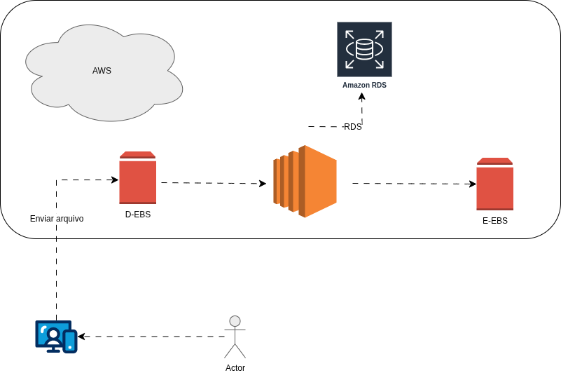

# Projeto AWS- Bootcamp Code Girl 2025 (DIO)

Nesse repositório irei compartilhar tudo o que aprendi através do curso.

## Objetivo

Ultilizar o desafio para absover todo o conteúdo absorvido.

## Modelo de Negocios AWS

- SAAS- software como serviço.
- IAAS- infraestrutura como serviço.
- PAAS- plataforma como serviço.

## Infraestrutura global da AWS

A AWS é a infraestrutura mais segura, abrangente e confiavel plataforma de nuvem.

- Regions: são áreas geográficas contendo várias availability.
- Availability zones: são datas centers independentes mas conectados logicamente, para garantir alta disponibilidade.

## Arquitetura em nuvem utilizando os principais serviços da AWS:

- Amazon EC2 → Computação em nuvem
- Amazon EBS → Armazenamento em blocos anexado ao EC2
- Amazon RDS → Banco de dados relacional gerenciado
- Amazon S3 → Armazenamento de objetos na nuvem

## Criação e uso de imagem AMI

AMI é uma imagem de maquina virtual pré configurada,que inclui informações de maquina virtual para iniciar uma instancia, como o sistema oeprativo.

## EBS

Sua função é fornecer armazenamento em bloco fiável(também conhecido como volumes ou discos rígidos).

Ele é um IAAS.

## Snapshots EBS

É um serviço de backup nativo do AWS que faz backup dos volumes do EBS em um determinado momento.

### Diferenças entre AMI e EBS

| AMI | EBS|
| --- | ------------- |
| faz cópia do servidor inteiro,incluindo todos os volumes EBS anexados.| é uma cópia pontual de um determinado volume. |

## Desafio 

- Desafio instâncias EC2.drawio → Diagrama exportado em formato de imagem

## Conclusão
 Esse desafio foi uma ótima forma de entender um pouco mais todo o conteúdo.

## Autora
Projeto desenvolvido por Silmara dos Santos Brandão, participante do Bootcamp Code Girls 2025.
